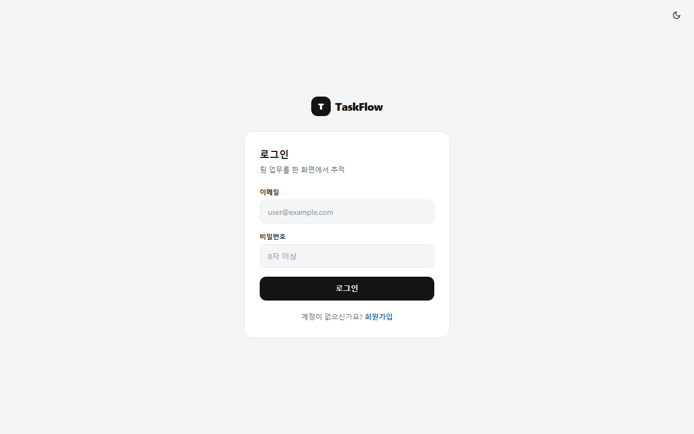
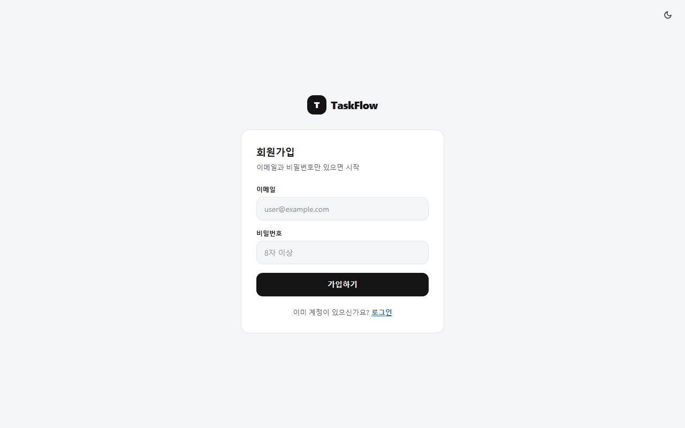
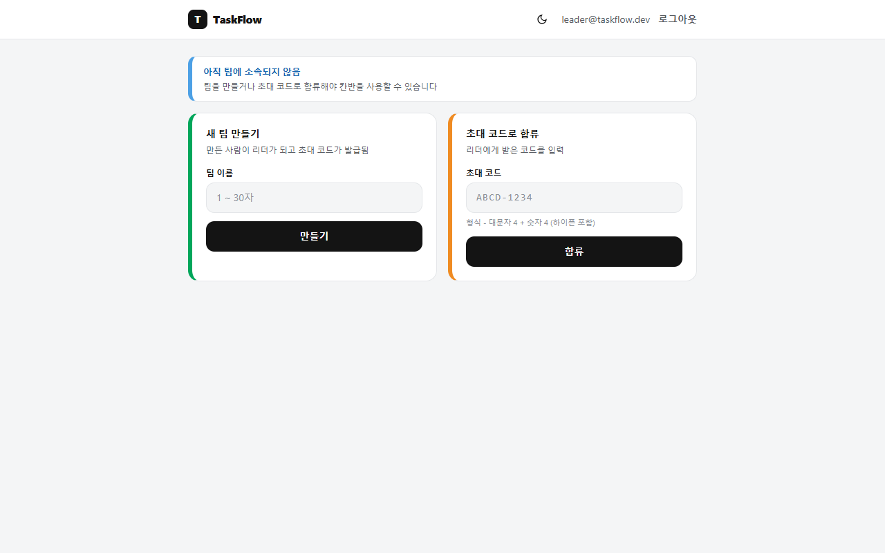
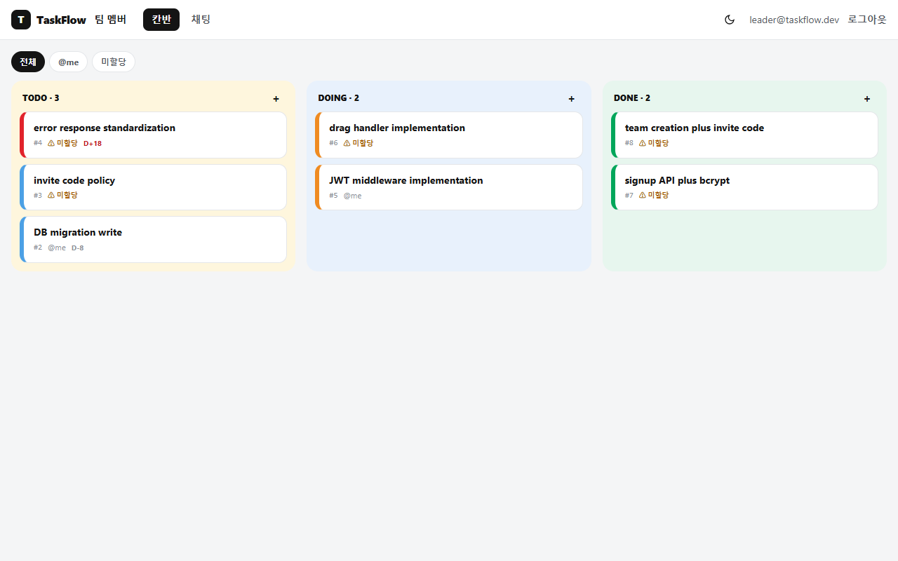
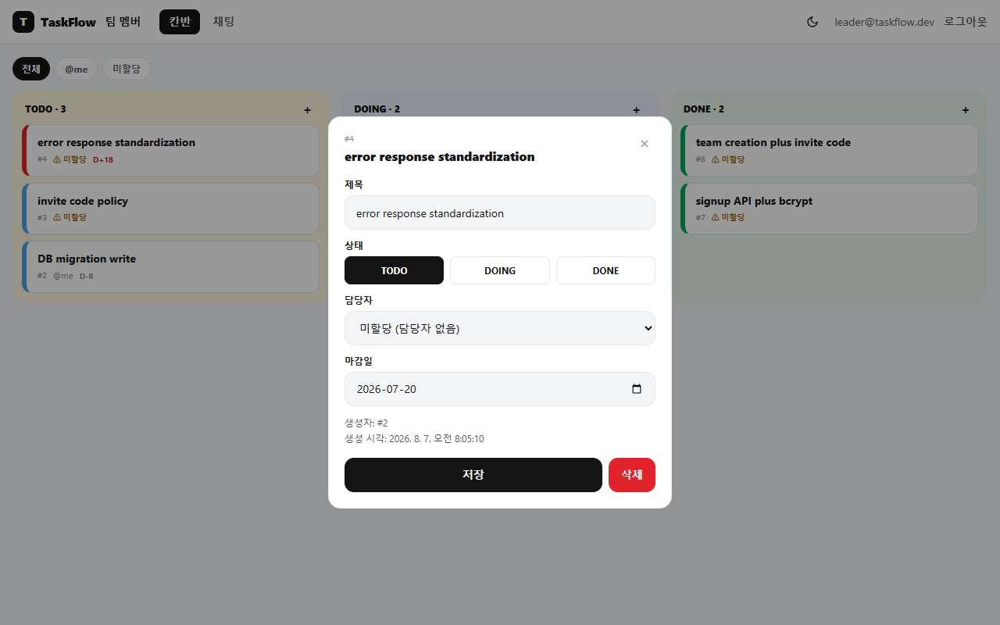
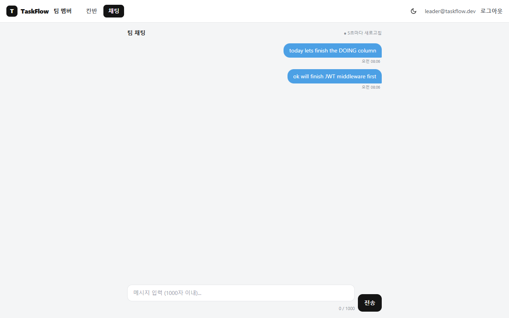

# TaskFlow MVP

소규모 팀(3~5인)이 **칸반 + 실시간에 가까운 채팅**을 한 화면에서 오가며 업무 진행 상황을 추적하는 웹 앱입니다.

- 백엔드: **FastAPI** (Python) + SQLAlchemy, JWT 인증
- 프론트엔드: **Vanilla JS + Tailwind CSS** (프레임워크 없음)
- DB: 로컬 **SQLite** / 운영 **PostgreSQL (Neon)** — `DATABASE_URL` 환경변수 하나로 전환
- 배포: **Vercel** (프론트 정적 파일 + 백엔드 Serverless Functions)
- 스펙 관리: **OpenSpec** (`openspec/`) — 모든 요구사항이 spec-driven 워크플로로 문서화되어 있음

> 이 저장소는 `docs/`의 프로그램 정의서·스토리보드(43장)를 기반으로 OpenSpec explore → propose → apply → archive 전 과정을 거쳐 구현되었습니다. 자세한 결정 근거는 `openspec/changes/archive/`의 아카이브된 change들을 참고하세요.

---

## 스크린샷

| 로그인 | 회원가입 |
|---|---|
|  |  |

| 팀 선택 | 팀 생성 완료 (초대코드) |
|---|---|
|  |  |

**칸반 보드** — TODO/DOING/DONE 3컬럼, 필터(전체/@me/미할당), 마감일 D-day 배지, 마감 초과 카드는 좌측 스트라이프가 자동으로 red로 바뀝니다 (`error response standardization` 카드, `D+18`).



**태스크 상세 모달** — 제목/상태/담당자/마감일을 한 번에 수정. creator 또는 팀 owner만 저장·삭제 가능.



**팀 채팅** — 5초 폴링 기반, 1000자 제한, 본인 메시지만 삭제 가능.



---

## 기능

| 영역 | 내용 |
|---|---|
| 인증 | 이메일/비밀번호 회원가입·로그인, JWT(24h, 갱신 없음), bcrypt 해시, stateless 로그아웃 |
| 팀 | 팀 생성 + 초대코드 자동 발급(재사용 가능), 초대코드로 합류, 팀 나가기, 멤버 목록(owner/member) |
| 칸반 | 태스크 생성/조회/필터(@me·미할당)/제목·담당자·마감일 수정/상태 이동(드래그)/삭제 |
| 마감일 | 선택적 마감일, `D-N`/`D-DAY`/`D+N` 배지, 마감 초과(미완료) 카드는 항상 red 스트라이프 |
| 채팅 | 팀 단위 메시지, 5초 폴링(`since=` 커서), 1000자 제한, 본인 메시지만 삭제 |
| 권한 | 태스크 상태변경·수정·삭제는 **creator 또는 팀 owner만** 가능 (일반 담당자는 불가) |
| 배포 | 로컬 SQLite ↔ 운영 Neon PostgreSQL을 `DATABASE_URL` 환경변수만으로 전환 |

### 범위 외 (의도적으로 구현하지 않음)

알림(이메일/SMS/푸시), 파일 첨부, 전문 검색, 세분화된 권한(admin 등급), 다국어, WebSocket(대신 폴링), 로그인 실패 잠금.

---

## 프로젝트 구조

```
taskflow-openspec/
├── backend/                 # FastAPI 백엔드
│   ├── app/
│   │   ├── core/             # config, db, security(JWT/bcrypt), errors(표준 에러 응답)
│   │   ├── routers/          # auth, teams, tasks, messages
│   │   ├── models.py          # SQLAlchemy 모델 (users/teams/tasks/messages)
│   │   ├── schemas.py         # pydantic 요청/응답 스키마
│   │   ├── deps.py            # 인증/팀멤버십/권한 의존성
│   │   └── main.py            # FastAPI 앱, CORS, 라우터 등록
│   ├── scripts/init_db.py    # 로컬 SQLite 초기화
│   ├── tests/test_api.py     # pytest (26개 시나리오)
│   └── requirements*.txt
├── frontend/                 # Vanilla JS + Tailwind 정적 SPA
│   ├── login.html / team.html / kanban.html / chat.html / index.html
│   ├── api.js                 # 공통 fetch 클라이언트 (JWT, 401 처리, 라우팅 가드)
│   ├── nav.js                  # 공통 헤더/모바일 메뉴/팀 멤버 패널
│   └── theme.js                # 디자인 토큰 (색상, 공통 클래스) - publish/theme.js 기준
├── publish/                   # 퍼블리싱 원본(디자인 시스템 기준 파일, 참고용)
├── openspec/
│   ├── specs/                 # 현재 유효한 요구사항 (capability별 spec.md)
│   └── changes/archive/       # 완료되어 아카이브된 change들 (proposal/design/tasks 기록)
├── docs/                      # 프로그램 정의서·스토리보드 PDF, 스크린샷
├── vercel.json                # Vercel 배포 라우팅 설정
└── DEPLOY.md                  # 배포 절차 (Vercel/Neon)
```

---

## 시작하기 (로컬 개발)

### 1. 백엔드

```bash
cd backend
python -m venv .venv
.venv/Scripts/activate        # Windows (macOS/Linux: source .venv/bin/activate)
pip install -r requirements-dev.txt
python scripts/init_db.py     # 로컬 SQLite 초기화
uvicorn app.main:app --reload --port 8000
```

기본적으로 `DATABASE_URL`이 없으면 `sqlite:///./taskflow.db`를 사용합니다.

### 2. 프론트엔드

```bash
cd frontend
python -m http.server 5500
```

`http://127.0.0.1:5500/login.html`로 접속하면 됩니다. `frontend/api.js`가 `localhost`/`127.0.0.1`에서 자동으로 API 베이스를 `http://127.0.0.1:8000`으로 잡습니다.

### 3. 테스트

```bash
cd backend
pytest tests/ -q
```

---

## API 요약 (18개 엔드포인트)

| 그룹 | 엔드포인트 | 설명 |
|---|---|---|
| Auth | `POST /auth/signup` | 회원가입, JWT 발급 |
| | `POST /auth/login` | 로그인, JWT 발급 |
| | `POST /auth/logout` | stateless 로그아웃 |
| | `GET /auth/me` | 내 정보 조회 |
| Team | `POST /teams` | 팀 생성 (초대코드 자동 발급) |
| | `POST /teams/join` | 초대코드로 합류 |
| | `GET /teams/{id}` | 팀 정보(초대코드 재조회) |
| | `GET /teams/{id}/members` | 멤버 목록 |
| | `DELETE /teams/{id}/leave` | 팀 나가기 |
| Task | `GET /teams/{id}/tasks` | 칸반 조회(필터: all/me/unassigned) |
| | `POST /teams/{id}/tasks` | 태스크 생성 |
| | `GET /tasks/{id}` | 태스크 상세 |
| | `PATCH /tasks/{id}/status` | 상태 변경 (creator/owner만) |
| | `PUT /tasks/{id}` | 제목/담당자/마감일 수정 (creator/owner만) |
| | `DELETE /tasks/{id}` | 삭제 (creator/owner만) |
| Chat | `GET /teams/{id}/messages` | 폴링 조회 (`since=`) |
| | `POST /teams/{id}/messages` | 메시지 전송 |
| | `DELETE /messages/{id}` | 삭제 (본인만) |

모든 에러 응답은 `{ "error": { "code": "...", "message": "...", "meta"?: {} } }` 형태로 표준화되어 있습니다.

---

## 배포

Vercel + Neon PostgreSQL로 배포합니다. 계정 연결과 환경변수 설정 절차는 [`DEPLOY.md`](./DEPLOY.md)를 참고하세요.

---

## OpenSpec 워크플로

이 프로젝트는 `openspec/` 아래에 **explore → propose → apply → archive** 흐름으로 관리됩니다.

- `openspec/specs/` — 현재 시스템이 지켜야 하는 요구사항 (capability별: `auth`, `teams`, `kanban-tasks`, `chat`, `deployment`)
- `openspec/changes/archive/` — 완료된 change의 `proposal.md`(왜), `design.md`(어떻게), `tasks.md`(무엇을 했는지) 기록

새 기능을 추가하려면 `/opsx:propose <change-name> <설명>`으로 시작하세요.
